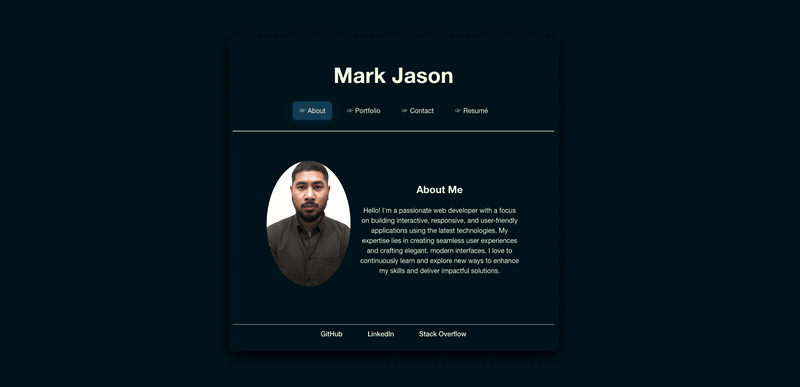

# React Portfolio

This is a personal portfolio website built using React. The portfolio showcases various projects, includes a bio, contact form, and a downloadable résumé. It is fully responsive and features modern design elements.

## Table of Contents

- [Demo](#demo)
- [Features](#features)
- [Installation](#installation)
- [Usage](#usage)
- [Deployment](#deployment)
- [Technologies](#technologies)
- [Contact](#contact)

## Demo

Check out the live demo of the portfolio here: [Live Demo](https://markjas0n-react.netlify.app)

## Features

- **Responsive Design**: Optimized for both desktop and mobile devices.
- **Modern UI**: Includes smooth transitions and elegant hover effects.
- **Project Showcase**: Displays projects in a scrollable container.
- **Contact Form**: Allows users to send messages directly through the site.
- **Downloadable Résumé**: Provides an option to download the résumé.
- **Smooth Navigation**: Includes modern and elegant page transitions.

## Installation

To run this project locally, follow these steps:

1. **Clone the repository:**
   ```bash
   git clone https://github.com/your-username/react-portfolio.git
2. **Navigate to the project directory:**
    ```bash
    npm install

## Usage 
 After installing the dependencies, you can run the project locally using:

    ```bash
    npm run dev

This command will start the development server, and the site will be accessible at http://localhost:5173/.

To create a production build:
    ```bash
    npm run build

This will generate a dist folder containing the optimized production files.

## Deployment
To deploy this project on Netlify:

1. Build the project:
    ```bash
    npm run build
2. Log in to Netlify and create a new site from Git.
3. Connect your repository and configure the build settings:
    - Build command: npm run build
    - Publish directory: dist
4. Deploy the site.

## Technologies
1. React: JavaScript library for building user interfaces.
2. Vite: Next Generation Frontend Tooling.
3. HTML5 & CSS3: Markup and styling for the web pages.
4. JavaScript: Programming language used for logic and interactivity.
5. Netlify: Platform for deploying and hosting web applications.

## Contact
[markjas0n@icloud.com](markjas0n@icloud.com)